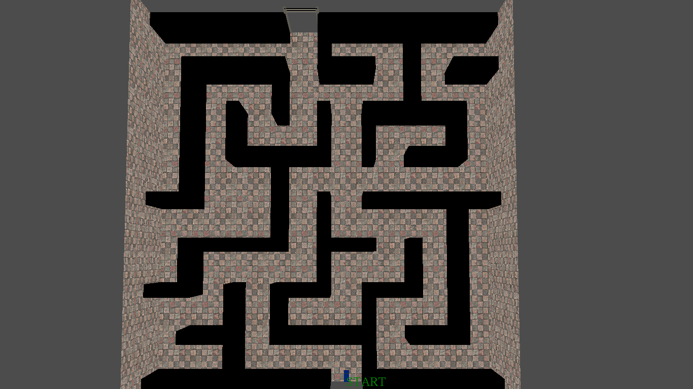
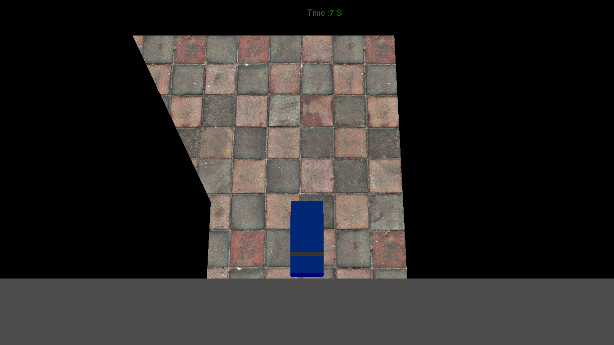
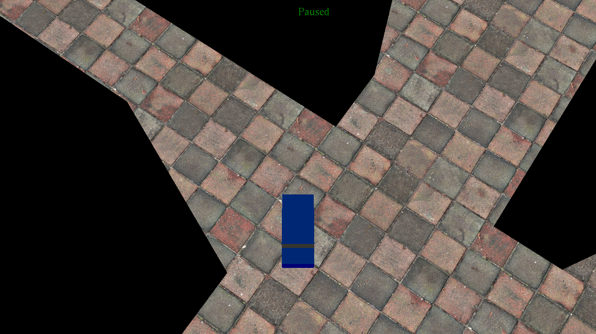
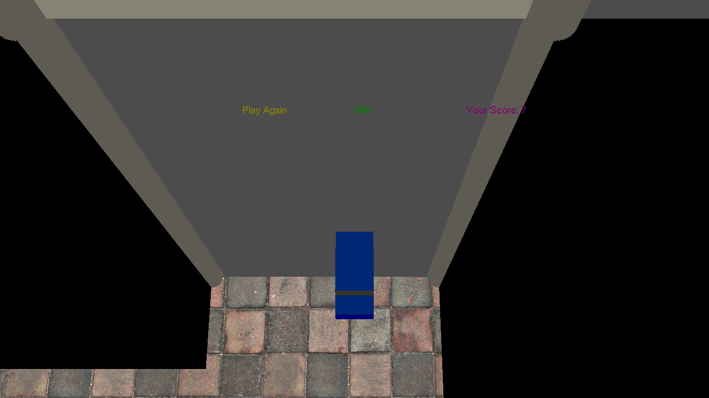

# The Maze Game
## Project: Game by C++ and OpenGL

### Install

This project requires **C++** and the following OpenGl libraries installed:

- [GL](https://www.opengl.org/)
- [Glu](https://www.opengl.org/)
- [Glut](https://www.opengl.org/)
- [Stb_image](https://www.opengl.org/)

You will also need to have software installed to run and execute an [visual studio](https://visualstudio.microsoft.com/)

### Code

Template code is provided in the `Maze Game.sln`.

### How to play

The game provides playing with these keys

- `W` or `w` move forward.
- `S` or `s` move backward.
- `A` or `a` move left.
- `D` or `d` move right.
- `←` move left with 90'.
- `→` move right with 90'.

### Camera View

The game provides move the camera with these kyes

- `↑` zoom in.
- `↓` zoom out.
- `Q` or `q` move up with the camera.
- `E` or `e` move down with the camera.

###### this is the start shape before you play

###### you can press enter to start playing

###### you can press space to pause and press again to continue

###### if you crashed that means game over and you can play again after pressing enter

###### there is a flag that means you win this round and you can play again after pressing enter

